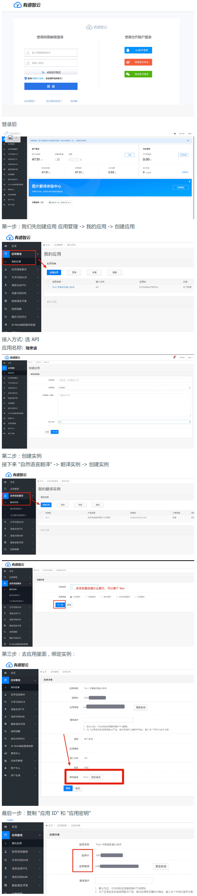
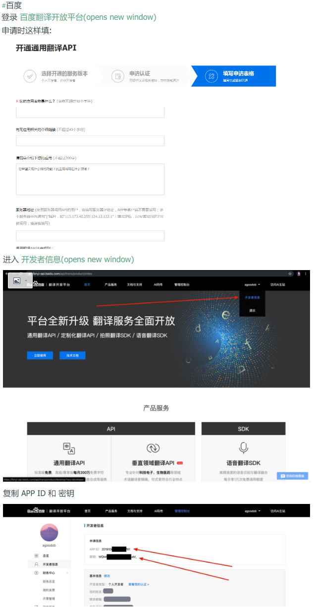
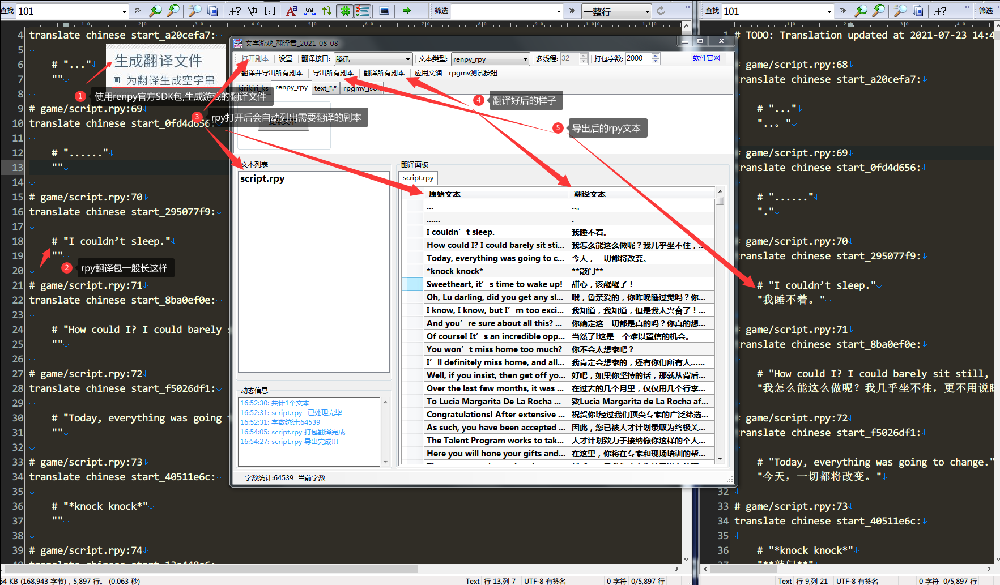
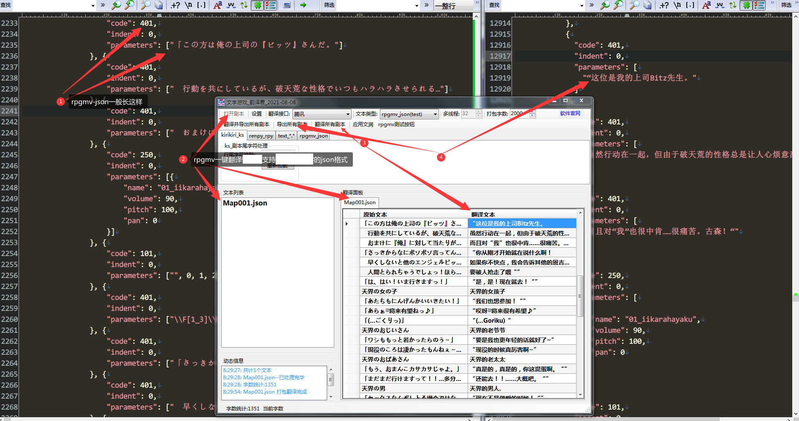

# 文字游戏 翻译君  
`任意文本` `游戏脚本` `影视字幕` `日文小说` `英法德...外语论文` `...` `任意支持的语言翻译成中文`  
`吉里吉里ks` `Renpy` `Rpgmv` `TyranoScript` `一键翻译`  
支持多种文件类型的一键翻译工具|您与汉化翻译组的距离或许只差一个软件
--|--  

[](https://github.com/sh2288/transer/releases/latest)


-38552538-ff69b4?style=flat&logo=tencent-qq)
-706514743-ff69b4?style=flat&logo=tencent-qq)


[github地址](https://sh2288.github.io/transer)
[码云gitee地址](https://gitee.com/sh2288/transer)

### 软件下载 [](https://github.com/sh2288/transer/releases/latest) [版本更新说明](#update)
[度盘提取码:bb3b](https://pan.baidu.com/s/1qObSVEx6ZijYcia8QKic3w) 
[github](https://github.com/sh2288/transer/releases/latest) 
[码云gitee](https://gitee.com/sh2288/transer/releases/latest)
[B站视频教程](https://www.bilibili.com/video/av69298736)|[youtube视频教程](https://youtu.be/8aXjUVPenW8)|[RPGMV游戏做汉化,一键翻译,只需5分钟](https://www.bilibili.com/video/BV1as4y1D7zH/)|[软件内正则表达式的说明](https://fyj.2288666.xyz/article/e649d2b8-30bf-4349-8a8f-4a90ce4ded3b)
--|--|--|--
<details> <summary> 🔊 翻译接口说明表</summary>

翻译接口 | 免费额度 | 多线程请求 | QPS | 翻译速度 | 翻译质量 | 打包字数最大值 
---|---|---|---|---|---|---
[有道智云](https://ai.youdao.com/login.s)|送50元|支持|未知|快|良|4000
[百度翻译(含高级版)](https://fanyi-api.baidu.com/api/trans/product/index)|送5或100万字/月|否|1或10|快|良|1000或3000
[腾讯翻译君](http://cloud.tencent.com/)|送500万字/月|否|5|快|良|2000
[彩云小译](https://dashboard.caiyunapp.com/user/sign_up/)|送100万字/月|支持|未知|很快|良|5000
[小牛翻译](https://niutrans.com/)|送20万字/天|否|50|很快|良|4000
[chatGPT翻译](https://openai.com/)|送3或5$/账户|否|3/分钟|极慢|优|600
阿里白嫖|不限|否|2|慢|可|150
有道白嫖|不限(量大会封IP,一段时间恢复)|否|2|一般|良|500
火山白嫖|不限|否|10|快|可|1000
腾讯交互白嫖|不限|否|10|快|可|2000
deepl白嫖|不限(量大会封IP,一段时间恢复)|否|5|快|良|1000
[deepl官方](https://www.deepl.com/translator)|送50万字/月|否|5|快|良|4000
[火山官方](https://www.volcengine.com/)|200万/月|否|10|快|可|5000
</details>

### 新用户,可先用阿里白嫖接口体验

### 最新消息  

#### 2023-07-21
1. 已添加火山正式API接口(测试版暂时在QQ群里发布)
火山翻译有一个优点,貌似不会翻译特殊的字符和脚本,会保留下来

#### 2023-07-20
1. 火山正式API接口(免费200万字/月)--计划

#### 2023-07-18 
文字游戏_翻译君_2023-07-18 V3.0.8599.16675
更新说明:
1. 添加deepl官方接口,需自行申请API-Key
2. 正则方式,可选择导出编码(utf-16或utf-8)
3. 修正mtools和vntext翻译文件导出的编码错误

#### 2023-07-14(测试版暂时在QQ群里发布)
1. 添加deepl白嫖接口(翻译量大可能会封IP一段时间,试试看吧)

#### 2023-07-10 
文字游戏_翻译君_2023-07-10 V3.0.8591.18438
更新说明:
1. 修复GPT的返回bug,减少GPT翻译时出现的错误
2. 添加GPT接口代理设置
3. 添加排错定位功能,方便后期
4. 添加版本更新检测

#### 2023-06-30
文字游戏_翻译君_2023-06-30  V3.0.8581.29017
更新说明:
1. 添加RPGMakertrans(RPGMaker2000-XP-VX-VXAce俗称龙头,马头,rpg游戏)工具导出文本的一键翻译[使用教程](https://fyj.2288666.xyz/article/2023-06-29)
2. 添加VNTextPatch,Mtool导出翻译文件的直接读取,一键翻译[使用教程](https://fyj.2288666.xyz/article/2023-06-28)
3. 修复GPT,system和user设置的弱智BUG

#### 2023-06-29
1. 添加RPGMakertrans(RPGMaker2000-XP-VX-VXAce俗称龙头,马头,rpg游戏)工具导出文本的一键翻译--测试版暂时在QQ群里发布

[RPGMaker2000-XP-VX-VXAce(龙头,马头)游戏翻译方法㊣](https://fyj.2288666.xyz/article/2023-06-29)

#### 2023-06-26
文字游戏_翻译君_2023-06-26 V3.0.8577.15852
更新说明:
1. 修复GPT接口bug
2. 修复GPT返回的数据尾部丢失`!`的bug
3. 修复renpy翻译包文件,出现`"xxx" xxx`结尾时,提取不到的bug

#### 2023-06-19
1. 修复GPT返回的数据尾部丢失`!`的bug,写代码时失误造成(已修复)

#### 2023-06-15
文字游戏_翻译君_2023-06-15 V3.0.8566.24945
更新说明:
1. 添加新的GPT模型`gpt-3.5-turbo-0613`,`gpt-3.5-turbo-16k`,`gpt-3.5-turbo-16k-0613`,`gpt-4-0613`,`gpt-4-32k`,`gpt-4-32k-0314`,`gpt-4-32k-0613`
2. 修复win11安全误报
3. 修复renpy翻译包文件,出现"xx” "xxx”时,提取和导入错误的bug
4. 调整gpt设置system和user的字符框
5. 加入`腾讯交互翻译`白嫖接口
6. 添加kr解包工具,Xmoe大神的KrkrExtract_5.0.0.2(软件目录\tools\下)

#### 2023-06-14(测试版暂时在QQ群里发布)
1. 添加新的GPT模型gpt-3.5-turbo-0613,gpt-3.5-turbo-16k,gpt-3.5-turbo-16k-0613,gpt-4-0613,gpt-4-32k,gpt-4-32k-0314,gpt-4-32k-0613
2. 修复win11安全误报

#### 2023-06-08
文字游戏_翻译君_2023-06-08 V3.0.8559.17882
更新说明:
1. 添加GPT,model,QPS,temperature,top-p设置选项
2. 采用json方式提交,减少GPT缩行发生,如缩行发生,添加GPT缩行提示
3. 修复renpy翻译包对话中的with处理
4. 添加renpy脚本[xxx]不过滤选项(高级用户用)
5. 添加右键菜单—选中部分整体下移功能
6. 加入火山白嫖接口

#### 2023-06-02 (版本未发布,预计下周)
1. 优化GPT翻译结果,进一步减少缩行发生,即使发生缩行,返回缩行发生的大概行数的信息,方便后期快速定位
2. 修复Renpy提取BUG,添加Renpy是否提取文字对话中的[脚本]选项(不明白的保持默认即可)

#### 2023-05-23
1. [正则分享库](https://fyj.2288666.xyz/article/2023-05-23)分享一些软件里的正则匹配表达式,mtool导出json格式,VNTextPatch导出的json格式,请使用纯文本方式打开,填入正则提取即可

#### 2023-05-08
1. 添加`火山翻译`白嫖接口,测试版暂时只在群里发布

#### 2023-05-01
<details> <summary>🎥 GPT翻译演示图</summary>


</details>

#### 2023-04-27
文字游戏_翻译君_2023-04-27 V3.0.8516.25600
更新说明:
1. 增加右键粘贴功能(方便后期)
2. 增加当前文件导出功能(方便后期)
3. 修复翻译实时存档导致的卡顿问题(逻辑错误,应为当前单文件,不是全部文件)

#### 2023-04-25
文字游戏_翻译君_2023-04-25 V3.0.8515.17555
更新说明:
1. 大幅度修复ChatGPT翻译后,由于句子合并,导致的错行问题
- (提交一个段落的原文给GPT时,GPT会根据整体上下文的内容进行翻译,有时GPT返回的结果会对原文并句,从而导致此问题)
2. 增加只翻译选中的行功能
3. 增加翻译实时存档功能(多线程翻译时不支持)
4. 增加从指定位置,继续翻译功能
5. 翻译文件列表,增加可单独,多选或全部清除功能

#### 2023-04-20
1. 大幅度修复ChatGPT翻译后,由于句子合并,导致的错行问题.(2023-04-19测试版,目前只在群里发布,稍后再正式发)

#### 2023-04-18
文字游戏_翻译君_2023-04-18 (3.0.8507.27796)
更新说明:
1. 加入ChatGPT接口,ChatGPT翻译功能(实验性)
2. 加入两个白嫖翻译接口(有道,阿里),无需任何API密钥.注意:白嫖的不如正式API的稳定,可能随时抽风
3. 加入导出原文译文,导入译文功能
4. 弃用腾讯官方SDK接口,改成自写V3签名,提高效率,节省空间


2023-04-14
1. 加入ChatGPT接口,ChatGPT翻译功能测试中...目前测试版只在QQ群发布
2. 加入两个白嫖翻译接口(有道,阿里),无需任何API密钥
3. 弃用腾讯云SDK,改自写v3签名


2023-04-10
下一版本更新计划
1. 加入白嫖翻译接口
2. 加入导出原文,导入译文功能


2023-04-04
好久没更新了😂

🔔小牛翻译2023年签到策略调整,目前每日签到可得50万字符流量,月满签可得1千500万,还是很良心的👍,强烈推荐!

2022-07-15

...|百度翻译API将于2022-08-01起施行新的API规则
---|---
标准版|QPS=1,免费5万/月
高级版|QPS=10,免费100万/月
尊享版|QPS=100,免费200万/月

下一版本计划中...

2022-01-28

...|[小牛翻译介绍](https://niutrans.com/)
---|---
免费额度|50万或满签1千万/月
多线请求|不支持
QPS|50
翻译速度|很快
打包字数最大值|4000
API|注册(普通)登录-控制台-个人中心-API-KEY
免费获额度|控制台-个人中心-签到码-绑定微信

2022-01-27(下一版本更新任务)
1. 百度企业版qps设置错误,已经修复...
2. 添加小牛翻译API
3. 按文件即时导出已翻译的文本(暂不支持多线程)

2021-11-15
1. 加入批量翻译中,即时导出文本,防止意外崩溃导致翻译好的文本无法导出(计划中...)

2021-10-15
1. 上个版本加入的功能,行号列右键菜单,使用说明(多用于跳过剧本脚本使用),可能说明里并没有把这个功能写明白--数字序号列点右键(按shift可多选,但不能多选翻译)


2021-09-15

1. 写了个shell,[rpgmaker_decrypter_shell](https://github.com/sh2288/rpgmaker_decrypter_shell),有需要折腾的拿去吧,一键解密rpgmv游戏,ogg一键转m4a,欢迎传播


2021-09-08

1. 解决错行问题(bug1)
2. 在文件中需要提取的翻译文本为空时,可移除
3. 加回rpgmv中CommonEvents.json,102选项的提取(上个版本忘记了)

2021-09-02 bug发现

1. RPGMV CommonEvents.json 中的102选项文本忘记提取了
2. RPGMV code 108,408疑似为注释,可不用提取翻译

2021-08-31 下一版本更新方向

1. 错行的处理(当翻译引擎漏翻时的处理)
2. rpgmv,当code为356,105,108...时的处理或增加选项,由用户自行选择

2021-08-30

1. RPGMV_json基本可以一键全翻,特殊除外,可达到完成度95%以上
2. 翻译面板右键菜单添加"跳过选项"

2021-08-27

1. rpgmv类型测试完毕,整体一键翻译有望实现

2021-08-24

1. 2021-08-24版本已经修正下列bug
2. 同时修复renpy bug

2021-08-20
1. 改进rpgmv类型,增加道具,装备等文字或剧本的提取
2. 改变现有ks提取中的bug
3. 正则表达式提取代码优化,修复现有bug
4. 添加复制原文按钮,方便后期二次文润
5. 下一版本将修正以上所有内容

### 软件用途

任意文本翻译 | 游戏脚本剧本翻译 | 字幕翻译 | 汉化辅助工具
---|---|---|---

### 软件介绍

1. 文本文件任意支持的语言(详见翻译API支持语言列表)翻译成简体中文
2. 翻译好的文件编码为utf16le有签名(仅ks或text类型)
3. 自动识别文件编码shift-jis和utf8,utf16,gb2312等(utf16be无签名除外)
4. 支持文件类型

---|*.ks | *.scn | *.rpy |*.json| \*.*(纯文本)
---|---|---|---|---|---
游戏引擎|吉里吉里xp3|吉里吉里xp3|rpy语言包|RPGMV|纯文本
提取剧本|自动|纯文本+正则|自动(只支持翻译包)|自动(*.json)|自动提取所有或正则提取

5. 支持的翻译接口,点击直接申请接口API,[翻译接口申请教程](#apitech)

翻译接口| [有道智云](https://ai.youdao.com/login.s) | [百度翻译(含高级版)](https://fanyi-api.baidu.com/api/trans/product/index) | [腾讯翻译君](http://cloud.tencent.com/) | [彩云小译](https://dashboard.caiyunapp.com/user/sign_up/) | [小牛翻译](https://niutrans.com/)
---|---|---|---|---|---
免费额度|50元|5万或100万字/月|500万字/月|100万字/月|满签1千万/月或50万
多线请求|支持|不支持|不支持|支持|不支持
QPS|不限|1或10|5|不限|50
翻译速度|快|快|一般|很快|很快
打包字数最大值|4000|1000或3000|2000|5000|4000

6. 翻译字数统计
7. 人名修改系统,通过正则提取游戏内人物"说话"时的名字,请根据翻译参考或游戏人物参考对照修改
8. 采用多线程同时翻译多个文件,目前最大支持32个文件同时翻译,效率是以前的单文件的32倍
9. 打包翻译,放弃以往一句一翻的方式,采取批量打包翻译方式
10. 文润系统(后期处理文本用,可以将API返回的常见错误加以修正,例如翻译好的文本中有大量的AAAA,AAAA是翻译结果,但并不一定是正确的结果,通过文润系统可以将所有文本中的AAAA,全部换成您设定好的BBBB)

文润 | 原始 | 修正
---|---|---
----|AAAA|BBBB
例1|阿傻姬|阿萨姬
例2|雪疯|雪风

11. 加入自动激活功能,只支持支付宝付款后的自动激活

### 使用指南
<a id='apitech'></a>
>#### 翻译接口申请教程
申请网址| [有道智云](https://ai.youdao.com/login.s) | [百度翻译(含高级版)](https://fanyi-api.baidu.com/api/trans/product/index) | [腾讯翻译君](http://cloud.tencent.com/) | [彩云小译](https://dashboard.caiyunapp.com/user/sign_up/) | [小牛翻译](https://niutrans.com/)
---|---|---|---|---|---

>##### 有道

>##### 百度[详细教程](https://www.3cinfo.net/course/220.html)

>##### 腾讯

>##### 彩云

>##### 小牛
[小牛翻译](https://niutrans.com/)|注册(普通)-登录-控制台-个人中心-API-KEY
---|---
>#### 软件使用教程

强烈建议您在正式翻译文件之前,先进行翻译测试(翻译接口-->翻译测试)|
---|

您甚至可以利用此项功能,直接将翻译测试的结果导入到游戏中|
--|


1. **打开剧本**-->批量选择需要翻译的剧本文件(一定要确认不是utf16be无签名的),选择要使用的**翻译接口**,点击**翻译并导出所有剧本**即可
2. 若希望翻译完成后进行修改润色校验等工作,可以先**翻译所有剧本**,然后批量文润或单项修改,全部完成后再**导出所有剧本**
3. **打包字数**设置为**0**时,翻译面板中的文本将执行按每行翻译,而不再将文本按照设定的字数打包
4. **应用文润**在设置窗口第二页,可以设置自己的文润对应表(注意,文润只针对翻译的结果进行修正,并不是原始语言的特定字典)

文润 | 原始 | 修正
---|---|---
----|AAAA|BBBB
例1|阿傻姬|阿萨姬
例2|雪疯|雪风

5. 文本类型**text_regex**表示纯文本+正则表达式,理论上可以翻译任意文本

文本类型 |*.ks | *.scn | *.rpy |*.json| \*.*(纯文本)
---|---|---|---|---|---
游戏引擎|吉里吉里xp3|吉里吉里xp3|rpy语言包|RPGMV|纯文本
提取剧本|自动|纯文本+正则|自动(只支持SDK导出的翻译包,空字串格式)|自动(*.json)|自动提取所有或正则提取
>##### ks文件类型

>##### rpy文件类型

[来自其他网站的renpy详细教程](https://nothamor.cn/index.php/archives/renpyTranslate.html)
>##### json(rpgmv)文件类型

此功能仅供测试还不完善,至于游戏中其他公共事件和数据库等,可通过正则表达式进行提取翻译汉化,当然开编辑器改也可
>##### *.*(纯文本)文件类型

>#### 文件位置说明

所有翻译好的文本位于翻译文件的目录下的\\(所用翻译接口)_(翻译文件类型)\目录下,譬如 \彩云_kirikiri_ks\
<a id='update'></a>
>#### 软件版本更新说明

当你使用软件设置好翻译接口,激活软件后,请妥善保管软件目录下的config.ini和wr.txt

这两个文件为您的软件设置和文润设置文件,请不要轻易删除

当更新新版本时,请将这两个文件,拷贝到新版软件的目录下


>#### 文字游戏_翻译君 内置工具列表
```
\tools\ krkrrel-cn(kr打包)
\tools\ GARbro(解包打包)
\tools\ KrkrExtract4.0.1.4(kr解包打包)
\tools\ Emeditor(支持多编码转换的文本编辑器)
```
>#### 已知BUG

2021-09-08版本,已经解决 bug1
1. 错行问题,由于打包翻译时,提交出去的数据和收到的数据(翻译引擎返回值)可能不一致导致,遇到这样的问题,请在表格中出现错行的位置,点击右键-->错行调整

设置打包字数为0时,可避免错行发生
