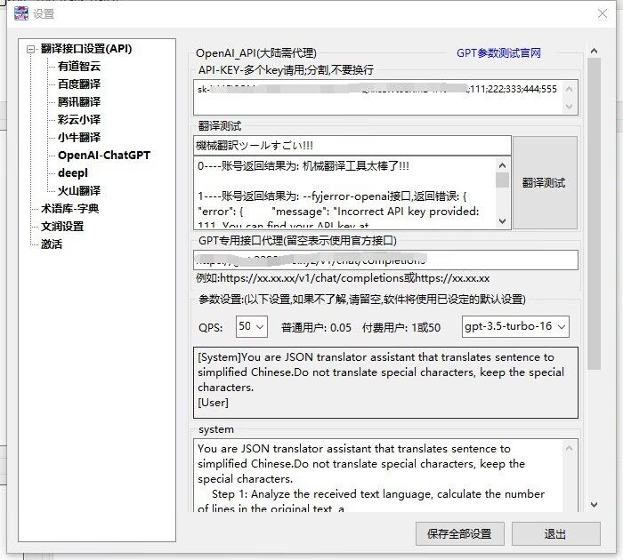
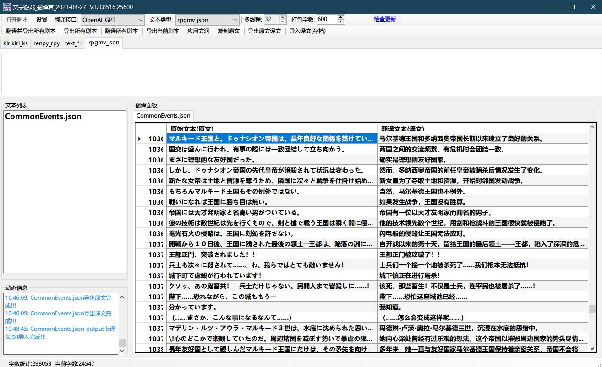
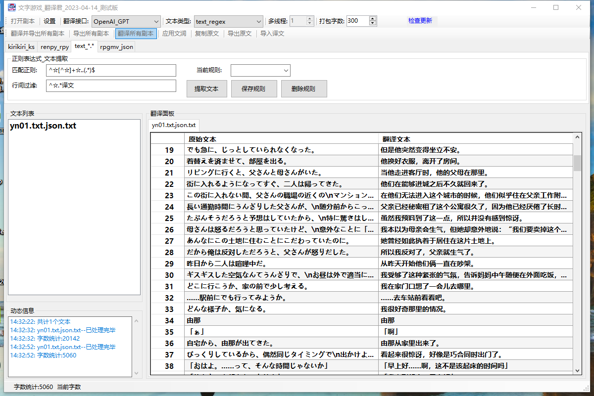
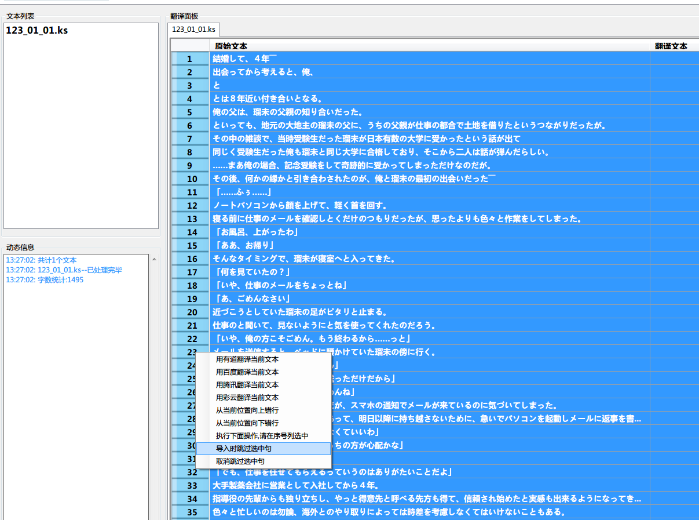
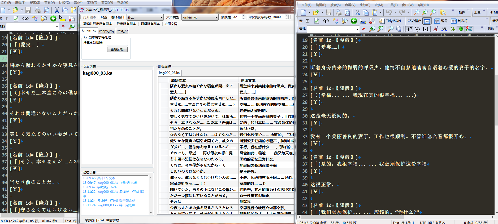
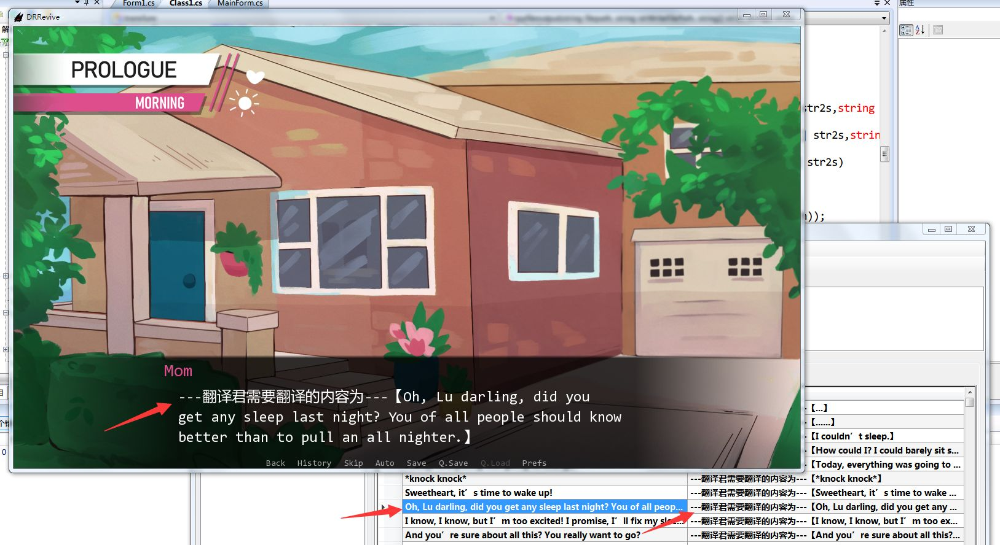
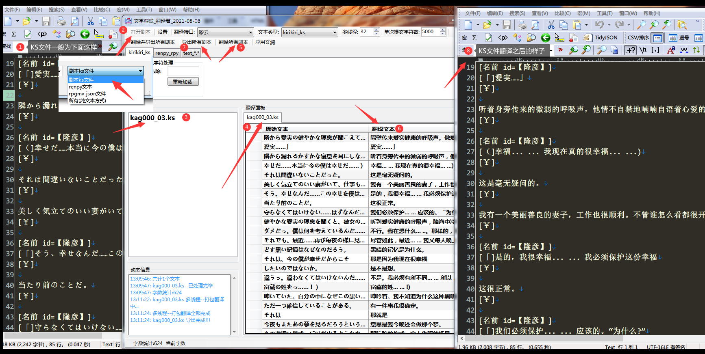
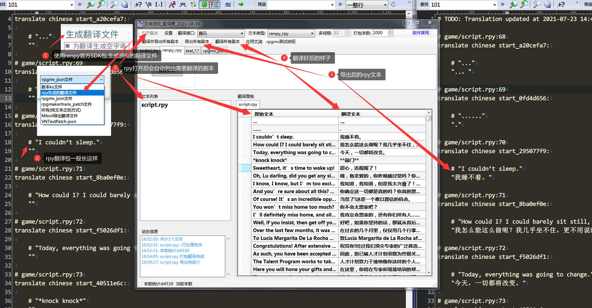
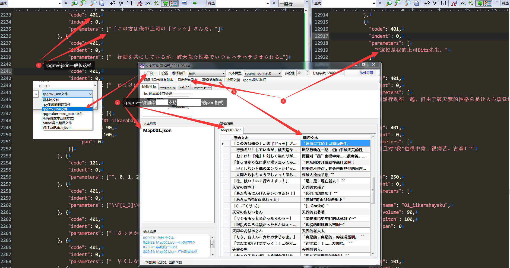
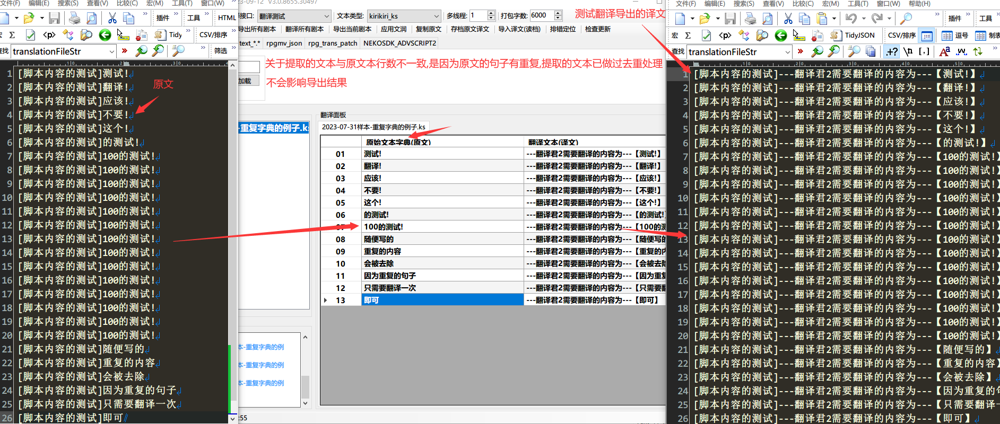

# 文字游戏 翻译君  
`任意文本` `游戏脚本` `影视字幕` `日文小说` `英法德...外语论文` `...` `任意支持的语言翻译成中文`  
`吉里吉里ks` `Renpy` `Rpgmv` `TyranoScript` `waffle` `BGI/Ethornell` `BISHOP` `一键翻译`  


支持多种文件类型的一键翻译工具|您与汉化翻译组的距离或许只差一个软件
--|--  

[](https://github.com/sh2288/transer/releases/latest)


[github地址](https://sh2288.github.io/transer)
[码云gitee地址](https://gitee.com/sh2288/transer)

### 软件下载 [](https://github.com/sh2288/transer/releases/latest)

[度盘提取码:bb3b](https://pan.baidu.com/s/1qObSVEx6ZijYcia8QKic3w) 
[github](https://github.com/sh2288/transer/releases/latest) 
[码云gitee](https://gitee.com/sh2288/transer/releases/latest)
<details> <summary> 🔊 版本更新说明</summary>
  
### 软件版本更新说明:
当你使用软件设置好翻译接口,激活软件后,请妥善保管软件目录下的`config.ini` `wr.txt` `syk.txt`

这些文件为您的软件设置和文润设置文件,请不要轻易删除

当更新新版本时,请将这两些文件,拷贝到新版软件的目录下
</details>

[B站视频教程](https://www.bilibili.com/video/av69298736)|[youtube视频教程](https://youtu.be/8aXjUVPenW8)|[RPGMV游戏做汉化,一键翻译,只需5分钟](https://www.bilibili.com/video/BV1as4y1D7zH/)|[软件内正则表达式的说明](https://fyj.2288666.xyz/article/e649d2b8-30bf-4349-8a8f-4a90ce4ded3b)
--|--|--|--
<details> <summary> 📖 更多实用教程</summary>
  
[Sakura13B-AI翻译_白嫖谷歌算力指南](https://fyj.2288666.xyz/article/2024-02-28)
[只需两步,翻译影视字幕SRT,ASS图文教程](https://fyj.2288666.xyz/article/2024-02-18)  
[BISHOP引擎,只需2步,一键翻译汉化教程](https://fyj.2288666.xyz/article/2023-10-09)  
[BGI/Ethornell引擎游戏,翻译教程,超简单!!!](https://fyj.2288666.xyz/article/2023-09-27)  
[Waffle华夫社(NEKOSDK_ADVSCRIPT2)翻译教程](https://fyj.2288666.xyz/article/2023-09-14)  
[RPGMakerVX-VXAce(龙头,马头)游戏翻译方法2㊣](https://fyj.2288666.xyz/article/2023-09-08)  
[RPGMaker2000-XP-VX-VXAce龙头马头游戏翻译方法㊣](https://fyj.2288666.xyz/article/2023-06-29)  
[来自其他网站的renpy详细教程](https://fyj.2288666.xyz/article/2023-05-29)   
[一些翻译君软件自用的正则表达式](https://fyj.2288666.xyz/article/2023-05-23)
</details>

<details> <summary> 🔊 支持的引擎(文件类型)</summary>
  
扩展名 | 引擎 | 剧本提取方式 
---|---|---
*.ks | 吉里吉里 | 自动
*.json | RPGMV | 自动
*.rpy | Renpy翻译包 | 自动
\*.\*  | 任意纯文本 | 手动正则提取
*.*二进制 | WAFFLE | 自动
*.*二进制 | BGI/Ethornell | 自动
*.dat二进制 | BISHOP | 自动
*.json | Mtool导出json | 自动
*.json | VNText导出json | 自动
*.srt | 影视字幕 | 自动
*.ass | 影视字幕 | 自动

</details>

<details> <summary> 🔊 翻译接口说明表</summary>


翻译接口 | 免费额度 | 多线程请求 | QPS | 翻译速度 | 翻译质量 | 建议打包字数 
---|---|---|---|---|---|---
[有道智云](https://ai.youdao.com/login.s)|送50元(用完为止)|支持|未知|快|良|4000
[百度翻译(含高级版)](https://fanyi-api.baidu.com/api/trans/product/index)|送5或100万字/月|否|1或10|快|良|1000或3000
[腾讯翻译君](http://cloud.tencent.com/)|免费500万字/月|否|5|快|良|2000
[彩云小译](https://dashboard.caiyunapp.com/user/sign_up/)|免费100万字/月|支持|未知|很快|良|5000
[小牛翻译](https://niutrans.com/)|免费20万字/天|否|50|很快|良|4000
[chatGPT翻译](https://openai.com/) [system提示词](https://github.com/sh2288/transer/blob/main/gpt-prompt-system)|送3或5$/账户|否|3/分钟|极慢|优|600
阿里白嫖|不限|否|2|慢|可|150
有道白嫖|不限(量大会封IP,一段时间恢复)|否|2|一般|良|500
火山白嫖|不限|否|10|快|良|1000
腾讯交互白嫖|不限|否|10|快|可|2000
deepl白嫖|不限(量大会封IP,一段时间恢复)|否|5|快|良|1000
[deepl官方](https://www.deepl.com/translator)|免费50万字/月|否|5|快|良|4000
[火山官方](https://www.volcengine.com/)|免费200万字/月|否|10|很快|良|4000
[阿里官方](https://www.aliyun.com/)|免费100万字/月|否|50|很快|良|4000
[谷歌Gemini](https://ai.google.dev/)|目前免费|否|1|一般|优|500以下
[Sakura-13B](https://github.com/SakuraLLM/Sakura-13B-Galgame)|完全免费(需自行部署)|否|20|块|优|500以下
</details>

#### 💡 Win10,11自带的Windows Defender若误报,请安装杀毒软件,安装完后即可,这里推荐[火绒安全软件](https://www.huorong.cn/person5.html?v=1)

### 最新消息  

### 文字游戏_翻译君_2024-03-05  V5.0.8830.25166

更新说明

- [x]   修复某些情况下,Renpy无法导出的bug
- [x]   修复GPT多线程返回翻译结果可能错位得bug
- [x]   添加导出存档时的覆盖提示,防止误操作

### 文字游戏_翻译君_2024-02-29  V5.0.8825.19552

更新说明

- [x]   Sakura-13B参数调整(防退化) [Sakura13B-AI翻译_白嫖谷歌算力指南](https://fyj.2288666.xyz/article/2024-02-28)
- [x]   添加SRT字幕可选双语输出
- [x]   修复`翻译并导出所有剧本`按钮,在使用GPT多线程翻译时卡死的BUG
- [x]   添加针对GPT多线程返回翻译结果校验(杜绝多线程冲突发生)
- [x]   调整纯文本正则,默认输出编码选项为UTF-16(之前默认没选,其实也是UTF-16)
- [x]   Gemini设置参数滑轨未读取数值的bug

### 文字游戏_翻译君_2024-02-22  V5.0.8818.17705

更新说明

- [x]   添加文件拖放功能(单或多文件拖放到剧本列表,再点击提取按钮即可)
- [x]   修复Rpgmv,json Parameters值可能为空时无法提取和导出的bug
- [x]   修复srt字幕,非常规格式提取错误的bug
- [x]   修复调整网易白嫖接口错误(若白嫖量大了还是会封IP)
- [x]   优化多线程逻辑大幅减少崩溃(除非API接口服务器发生异常)
- [x]   优化使用ChatGPT时,线程数可手动调节,最大值为账号数(无论线程数设置多少,都是在key池中轮询,请确保每个key都可用)

### 文字游戏_翻译君_2024-02-18  V5.0.8814.15735

更新说明

- [x]   修复当GPT使用单线程时,重试等待时长的bug,以及多线程时减少线程之间可能会冲突的bug
- [x]   添加两种字幕文件直读解析,srt,ass(ass暂时只支持提取[Events]下的Dialogue)
- [x]   添加新的自动编码识别库,放弃19年自动编码识别方式

### 文字游戏_翻译君_2024-02-05  V5.0.8801.22067

更新说明

- [x]  修复GPT多线程,key数量很多时,可能会发生后面key排不进线程的bug
- [x]  修复翻译并导出所有剧本按钮(老手专用),gpt多线程未启用的bug
- [x]  添加gpt-3.5-turbo-0125模型支持
- [x]  优化一键定位漏翻,当译文为空或null时,归为漏翻的范围
- [x]  保存设置不用再重启,上个版本搞错了😞

### 文字游戏_翻译君_2024-02-02  V5.0.8798.15965

更新说明

- [x]  添加OpenAI_GPT多线程支持(API-Key数量大于1,打包字数不为0时),线程数根据API-Key的数量自动计算
- [x]  添加Sakura-13B接口
- [x]  修复多线程时,容易崩溃的bug,若还是崩溃请适当减少线程数
- [x]  小牛多账号支持,api账号一行一个填写
- [x]  优化排错定位(疑似),支持日文,GPT错行,漏翻.添加快捷键,连续按快捷键表示向下定位滚动,可一键定位所有错误,右键一键补翻
- [x]  添加右键使用当前接口翻译
- [x]  修复百度弱智错误
- [x]  优化降低翻译进行中时,容易崩溃的bug(索引超出数组范围),若文本中含有特殊符号,例如换行符\n等容易出现此报错.请用正则过滤干净再翻译
- [x]  接口切换为空时检查config，提示用户填写
- [x]  正则表达式，引用分组说明,若使用分组匹配请在括号里添加?:,例如(?:表达式)
- [x]  自动补全GPT Endpoint,不用再输/V1/chat/....


### 文字游戏_翻译君_2024-01-24  V5.0.8789.23422
更新说明

- [x]  修复提示未连接网络的bug
- [x]  修复VNText过滤正则未启用的bug
- [x]  优化排错定位(疑似),支持日文,GPT错行,漏翻,并添加快捷键,连续按快捷键表示向下定位滚动
- [x]  修复多线程时,容易崩溃的bug,若还是崩溃请适当减少线程数


### 文字游戏_翻译君_2024-01-23  V5.0.8788.28118 
更新说明

- [x]  添加导出导入原文译文到JSON功能,类Mtool导出JSON格式
- [x]  优化文件类型选择(直接从主面板选好类型,再点打开文件时,文件类型过滤器,会自动选好)
- [x]  修复一些BUG

### 文字游戏_翻译君_2024-01-15  V3.0.8780.16820
更新说明
- [x]  添加终止翻译按钮
- [x]  调整优化右键翻译菜单(所有翻译接口绑定到子菜单)
- [x]  添加http代理设置,不用再设置全局(仅用于gemini和GPT)
- [x]  修复右键块翻译,当congfig更改时未读取的bug
- [x]  调整,当Gemini和GPT返回结果等于原文时,自动重翻,最多重试3次

#### 文字游戏_翻译君_2024-01-09  V3.0.8774.18772
更新说明  
1. 添加Google_AI_Gemini接口,已关闭内容审查(建议打包字数设置500以下)
2. 添加Mtool导出的JSON直接提取
3. 添加VNtext导出的JSON直接提取
4. 修复转区后无法读取ini(gb2312)的bug,改为使用json保存设置
5. 修复小牛(重写)超过800字数时,服务器报错(niutrans,2024年以前不曾报错😟)
6. 修复腾讯交互翻译白嫖接口
7. 优化翻译测试字串,使用〖XXX〗表示需翻译的内容,方便翻译测试
7. 优化提取方法,可以先行载入文本,再选择文件类型进行载入(如果一开始载入文件,类型选择错误,不用再次打开文本,直接在面板上选正确的类型,点击"提取文本即可)

#### 2024-01-05 (测试版暂时在QQ群里发布)
1. 添加Google_AI_Gemini接口
2. 更改config.ini为json格式ini弃用
3. 添加mtool_json格式的直接提取

#### 2023-11-09 (测试版暂时在QQ群里发布)
1. 添加对GPT最新模型的支持 `gpt-3.5-turbo-1106` `gpt-4-1106-preview`

#### 文字游戏_翻译君_2023-10-12 V3.0.8685.15935
更新说明
1. 添加BISHOP的二进制文本的直接读取和导出写入 [翻译教程](https://fyj.2288666.xyz/article/2023-10-09)
2. 修复BGI/Ethornell提取重复人名或文本的BUG(上个版本忘记去重了😂~~~)
3. 添加BISHOP,BGI行间过滤正则,仅供参考,不同游戏可能不一样  
BISHOP : `\\[Bbn]|「|」`  
BGI : `[<>「」\/Rr]`

<details> <summary> 🔊 更新历史</summary>

#### 文字游戏_翻译君_2023-09-27 V3.0.8670.17854  
更新说明  
1. 添加GBK2SJIS库,支持导出sjis编码(正则方式和二进制文本方式)(高手用),可解决不支持转换utf,gbk编码的游戏,但缺点是缺字,只能用sjis里字形相近的字符表示~!
2. 添加`BGI/Ethornell`的二进制文本的直接读取和导出写入[翻译教程](https://fyj.2288666.xyz/article/2023-09-27)
#### 2023-09-20 (测试版暂时在QQ群里发布)
1. 添加GBK2SJIS库,支持导出sjis编码(正则方式和NEKOSDK_ADVSCRIPT2)(高手用),可解决不支持转换utf,gbk编码的游戏,但缺点是缺字~!

#### 2023-09-15 文字游戏_翻译君_2023-09-15 V3.0.8658.15225
更新说明
1. 修复RPGMakertrans导出的文本类型,翻译后有可能导出为空的bug
2. 添加NEKOSDK_ADVSCRIPT2(waffle)的二进制txt文本的直接读取和导出写入[翻译教程](https://fyj.2288666.xyz/article/2023-09-14)
3. 添加正则规则码导入导出功能,方便正则规则码的分享交流,导出导入规则码格式如下:
```
transer_regex://VlhBY2VUcmFuc2xhdG9yW+S0hV0oPzw9XCIpLis/KD89XCIpW+S0hV1cXC4rP1xdfCx8XFxcXC58Z2Fpbl9tZWRhbC4rP1wpfFwkfFxcclxcbg==
```

#### 2023-09-12 (测试版暂时在QQ群里发布)
1. 添加NEKOSDK_ADVSCRIPT2(waffle)的二进制txt文本直接读取和导出写入

#### 2023-09-12
1. 修复RPGMakertrans导出的文本类型,翻译后有可能导出为空的bug

#### 2023-09-04 文字游戏_翻译君_2023-09-04  V3.0.8647.16478 
1. 修复火山接口的400错误

#### 2023-08-21 文字游戏_翻译君_2023-08-21  V3.0.8633.23686 
更新说明
1. 修复吉里吉里引擎,ks文件,在某些特殊情况下,提取可能重复的bug
2. 修复字数设置为0时,导出的文本可能出现多余行的bug
3. 添加gpt多账号key支持(注意,用同账号下的多key并不能提速!多账号key目的是大幅提升速度,请保证每个key都有效可用,QPS请遵循你账号设置,多个key程序会按照key数量自动计算)
4. 添加阿里翻译API接口(免费100万/月) [阿里翻译API申请教程](https://github.com/sh2288/transer/blob/main/manual/%E5%90%84%E5%B9%B3%E5%8F%B0%E7%BF%BB%E8%AF%91API%E7%94%B3%E8%AF%B7%E6%95%99%E7%A8%8B.md)
5. 修复当译文列被修改时,排错定位失效的bug

#### 2023-08-18 (测试版暂时在QQ群里发布)
1. 添加阿里翻译API接口(免费100万/月) [阿里翻译API申请教程](https://github.com/sh2288/transer/blob/main/manual/%E5%90%84%E5%B9%B3%E5%8F%B0%E7%BF%BB%E8%AF%91API%E7%94%B3%E8%AF%B7%E6%95%99%E7%A8%8B.md)

#### 2023-08-17 (测试版暂时在QQ群里发布)
1. 修复吉里吉里引擎,ks文件,在某些特殊情况下,提取可能重复的bug
2. 修复字数设置为0时,导出的文本可能出现多余行的bug
3. 添加gpt多账号key支持(注意,用同账号下的多key并不能提速!多账号key目的是大幅提升速度,请保证每个key都有效可用,QPS请遵循你账号设置,多个key程序会按照key数量自动计算)
   


#### 2023-08-14
1. 神器VNtextPatch,可惜命令行,于是写了个gui_shell[VNTextPatch_Gui_Shell](https://github.com/sh2288/VNTextPatch_GUI),配合翻译君如虎添翼🚀
2. 修复吉里吉里引擎,ks文件,在某些特殊情况下,提取可能重复的bug

#### 2023-08-03 文字游戏_翻译君_2023-08-03 V3.0.8615.24198
更新说明
1. 修复术语库重复的bug
2. 更新小牛使用原生支持的术语库方式
3. 序号列自动宽度
4. 重写吉里吉里引擎,ks文件处理方法
5. 修复以前翻译字典替换误伤脚本的bug例如`[aabbcc]aa`翻译为`[AAbbcc]AA`的错误,修复几处提取错误的bug`//aaaa` `#aaaaaa`
6. 排错定位加入漏翻疑似定位(仅支持日文,英文单词)

#### 2023-08-02 (测试版暂时在QQ群里发布)

1. 重写吉里吉里引擎,ks文件处理方法
2. 修复以前翻译字典替换误伤脚本的bug例如`[aabbcc]aa`翻译为`[AAbbcc]AA`的错误,修复几处提取错误的bug`//aaaa` `#aaaaaa`
3. 排错定位加入漏翻疑似定位(目前仅支持日文)


#### 2023-07-28 (测试版暂时在QQ群里发布)

1. 修复术语库重复的bug
2. 更新小牛使用原生支持的术语库方式
3. 序号列自动宽度

#### 2023-07-26 文字游戏_翻译君_2023-07-26 V3.0.8607.19420
更新说明
1. 添加火山正式API接口(免费200万字/月,QPS=10,最大字数4000)[开通API教程](https://www.volcengine.com/docs/4640/127682)
2. 添加`术语库-字典`功能(高级用户可通过自定义字典设置,生成更为准确的翻译结果,deepl接口此功能不可用)[Q群大佬整理好的一份术语库-字典](https://fyj.2288666.xyz/article/2023-07-26)
3. 修复renpy翻译文件导出时,未能处理`\"`的bug
4. 修复renpy翻译文件`"xxxx” (xx)`,不能提取和导入的bug

#### 2023-07-25
1. 添加术语库-字典功能(高级用户可通过自定义字典设置,生成更为准确的翻译结果,deepl接口此功能不可用)
2. 修复renpy导出时,未能处理`\"`的bug

#### 2023-07-24
1. 添加术语库-字典功能(高级用户可通过自定义字典设置,生成更为准确的翻译结果,暂时只支持gpt接口)

#### 2023-07-21
1. 已添加火山正式API接口(测试版暂时在QQ群里发布)[开通API教程](https://www.volcengine.com/docs/4640/127682)

火山翻译有一个优点,貌似不会翻译特殊的字符和脚本,会保留下来

#### 2023-07-20
1. 火山正式API接口(免费200万字/月)--计划

#### 2023-07-18 
文字游戏_翻译君_2023-07-18 V3.0.8599.16675
更新说明:
1. 添加deepl官方接口,需自行申请API-Key
2. 正则方式,可选择导出编码(utf-16或utf-8)
3. 修正mtools和vntext翻译文件导出的编码错误

#### 2023-07-14(测试版暂时在QQ群里发布)
1. 添加deepl白嫖接口(翻译量大可能会封IP一段时间,试试看吧)

#### 2023-07-10 
文字游戏_翻译君_2023-07-10 V3.0.8591.18438
更新说明:
1. 修复GPT的返回bug,减少GPT翻译时出现的错误
2. 添加GPT接口代理设置
3. 添加排错定位功能,方便后期
4. 添加版本更新检测


#### 2023-06-30
文字游戏_翻译君_2023-06-30  V3.0.8581.29017
更新说明:
1. 添加RPGMakertrans(RPGMaker2000-XP-VX-VXAce俗称龙头,马头,rpg游戏)工具导出文本的一键翻译[使用教程](https://fyj.2288666.xyz/article/2023-06-29)
2. 添加VNTextPatch,Mtool导出翻译文件的直接读取,一键翻译[使用教程](https://fyj.2288666.xyz/article/2023-06-28)
3. 修复GPT,system和user设置的弱智BUG

#### 2023-06-29
1. 添加RPGMakertrans(RPGMaker2000-XP-VX-VXAce俗称龙头,马头,rpg游戏)工具导出文本的一键翻译--测试版暂时在QQ群里发布

[RPGMaker2000-XP-VX-VXAce(龙头,马头)游戏翻译方法㊣](https://fyj.2288666.xyz/article/2023-06-29)

#### 2023-06-26
文字游戏_翻译君_2023-06-26 V3.0.8577.15852
更新说明:
1. 修复GPT接口bug
2. 修复GPT返回的数据尾部丢失`!`的bug
3. 修复renpy翻译包文件,出现`"xxx" xxx`结尾时,提取不到的bug

#### 2023-06-19
1. 修复GPT返回的数据尾部丢失`!`的bug,写代码时失误造成(已修复)

#### 2023-06-15
文字游戏_翻译君_2023-06-15 V3.0.8566.24945
更新说明:
1. 添加新的GPT模型`gpt-3.5-turbo-0613`,`gpt-3.5-turbo-16k`,`gpt-3.5-turbo-16k-0613`,`gpt-4-0613`,`gpt-4-32k`,`gpt-4-32k-0314`,`gpt-4-32k-0613`
2. 修复win11安全误报
3. 修复renpy翻译包文件,出现"xx” "xxx”时,提取和导入错误的bug
4. 调整gpt设置system和user的字符框
5. 加入`腾讯交互翻译`白嫖接口
6. 添加kr解包工具,Xmoe大神的KrkrExtract_5.0.0.2(软件目录\tools\下)

#### 2023-06-14(测试版暂时在QQ群里发布)
1. 添加新的GPT模型gpt-3.5-turbo-0613,gpt-3.5-turbo-16k,gpt-3.5-turbo-16k-0613,gpt-4-0613,gpt-4-32k,gpt-4-32k-0314,gpt-4-32k-0613
2. 修复win11安全误报

#### 2023-06-08
文字游戏_翻译君_2023-06-08 V3.0.8559.17882
更新说明:
1. 添加GPT,model,QPS,temperature,top-p设置选项
2. 采用json方式提交,减少GPT缩行发生,如缩行发生,添加GPT缩行提示
3. 修复renpy翻译包对话中的with处理
4. 添加renpy脚本[xxx]不过滤选项(高级用户用)
5. 添加右键菜单—选中部分整体下移功能
6. 加入火山白嫖接口

#### 2023-06-02 (版本未发布,预计下周)
1. 优化GPT翻译结果,进一步减少缩行发生,即使发生缩行,返回缩行发生的大概行数的信息,方便后期快速定位
2. 修复Renpy提取BUG,添加Renpy是否提取文字对话中的[脚本]选项(不明白的保持默认即可)

#### 2023-05-23
1. [正则分享库](https://fyj.2288666.xyz/article/2023-05-23)分享一些软件里的正则匹配表达式,mtool导出json格式,VNTextPatch导出的json格式,请使用纯文本方式打开,填入正则提取即可

#### 2023-05-08
1. 添加`火山翻译`白嫖接口,测试版暂时只在群里发布

#### 2023-05-01
<details> <summary>🎥 GPT翻译演示图</summary>



</details>

#### 2023-04-27
文字游戏_翻译君_2023-04-27 V3.0.8516.25600
更新说明:
1. 增加右键粘贴功能(方便后期)
2. 增加当前文件导出功能(方便后期)
3. 修复翻译实时存档导致的卡顿问题(逻辑错误,应为当前单文件,不是全部文件)

#### 2023-04-25
文字游戏_翻译君_2023-04-25 V3.0.8515.17555
更新说明:
1. 大幅度修复ChatGPT翻译后,由于句子合并,导致的错行问题
- (提交一个段落的原文给GPT时,GPT会根据整体上下文的内容进行翻译,有时GPT返回的结果会对原文并句,从而导致此问题)
2. 增加只翻译选中的行功能
3. 增加翻译实时存档功能(多线程翻译时不支持)
4. 增加从指定位置,继续翻译功能
5. 翻译文件列表,增加可单独,多选或全部清除功能

#### 2023-04-20
1. 大幅度修复ChatGPT翻译后,由于句子合并,导致的错行问题.(2023-04-19测试版,目前只在群里发布,稍后再正式发)

#### 2023-04-18
文字游戏_翻译君_2023-04-18 (3.0.8507.27796)
更新说明:
1. 加入ChatGPT接口,ChatGPT翻译功能(实验性)
2. 加入两个白嫖翻译接口(有道,阿里),无需任何API密钥.注意:白嫖的不如正式API的稳定,可能随时抽风
3. 加入导出原文译文,导入译文功能
4. 弃用腾讯官方SDK接口,改成自写V3签名,提高效率,节省空间


2023-04-14
1. 加入ChatGPT接口,ChatGPT翻译功能测试中...目前测试版只在QQ群发布
2. 加入两个白嫖翻译接口(有道,阿里),无需任何API密钥
3. 弃用腾讯云SDK,改自写v3签名





2023-04-10
下一版本更新计划
1. 加入白嫖翻译接口
2. 加入导出原文,导入译文功能


2023-04-04
好久没更新了😂

🔔小牛翻译2023年签到策略调整,目前每日签到可得50万字符流量,月满签可得1千500万,还是很良心的👍,强烈推荐!

2022-07-15

...|百度翻译API将于2022-08-01起施行新的API规则
---|---
标准版|QPS=1,免费5万/月
高级版|QPS=10,免费100万/月
尊享版|QPS=100,免费200万/月

下一版本计划中...

2022-01-28

...|[小牛翻译介绍](https://niutrans.com/)
---|---
免费额度|50万或满签1千万/月
多线请求|不支持
QPS|50
翻译速度|很快
打包字数最大值|4000
API|注册(普通)登录-控制台-个人中心-API-KEY
免费获额度|控制台-个人中心-签到码-绑定微信

2022-01-27(下一版本更新任务)
1. 百度企业版qps设置错误,已经修复...
2. 添加小牛翻译API
3. 按文件即时导出已翻译的文本(暂不支持多线程)

2021-11-15
1. 加入批量翻译中,即时导出文本,防止意外崩溃导致翻译好的文本无法导出(计划中...)

2021-10-15
1. 上个版本加入的功能,行号列右键菜单,使用说明(多用于跳过剧本脚本使用),可能说明里并没有把这个功能写明白--数字序号列点右键(按shift可多选,但不能多选翻译)


2021-09-15

1. 写了个shell,[rpgmaker_decrypter_shell](https://github.com/sh2288/rpgmaker_decrypter_shell),有需要折腾的拿去吧,一键解密rpgmv游戏,ogg一键转m4a,欢迎传播


2021-09-08

1. 解决错行问题(bug1)
2. 在文件中需要提取的翻译文本为空时,可移除
3. 加回rpgmv中CommonEvents.json,102选项的提取(上个版本忘记了)

2021-09-02 bug发现

1. RPGMV CommonEvents.json 中的102选项文本忘记提取了
2. RPGMV code 108,408疑似为注释,可不用提取翻译

2021-08-31 下一版本更新方向

1. 错行的处理(当翻译引擎漏翻时的处理)
2. rpgmv,当code为356,105,108...时的处理或增加选项,由用户自行选择

2021-08-30

1. RPGMV_json基本可以一键全翻,特殊除外,可达到完成度95%以上
2. 翻译面板右键菜单添加"跳过选项"

2021-08-27

1. rpgmv类型测试完毕,整体一键翻译有望实现

2021-08-24

1. 2021-08-24版本已经修正下列bug
2. 同时修复renpy bug

2021-08-20
1. 改进rpgmv类型,增加道具,装备等文字或剧本的提取
2. 改变现有ks提取中的bug
3. 正则表达式提取代码优化,修复现有bug
4. 添加复制原文按钮,方便后期二次文润
5. 下一版本将修正以上所有内容

</details>

### 软件用途

任意文本翻译 | 游戏脚本剧本翻译 | 字幕翻译 | 汉化辅助工具
---|---|---|---

### 软件介绍

1. 文本文件任意支持的语言(详见翻译API支持语言列表)翻译成简体中文
2. 翻译好的文件编码为utf16le有签名(仅ks或text类型)
3. 自动识别文件编码shift-jis和utf8,utf16,gb2312等(utf16be无签名除外)
4. 支持文件类型

扩展名 | 引擎 | 剧本提取方式 
---|---|---
*.ks | 吉里吉里 | 自动
*.json | RPGMV | 自动
*.rpy | Renpy翻译包 | 自动
\*.\*  | 任意纯文本 | 手动正则提取
*.*二进制 | WAFFLE | 自动
*.*二进制 | BGI/Ethornell | 自动
*.dat二进制 | BISHOP | 自动
*.json | Mtool导出json | 自动
*.json | VNText导出json | 自动
*.srt | 影视字幕 | 自动
*.ass | 影视字幕 | 自动

5. 支持的翻译接口,点击直接申请接口API,[翻译接口申请教程](#apitech)
<details> <summary> 🔊 翻译接口说明表</summary>


翻译接口 | 免费额度 | 多线程请求 | QPS | 翻译速度 | 翻译质量 | 建议打包字数 
---|---|---|---|---|---|---
[有道智云](https://ai.youdao.com/login.s)|送50元(用完为止)|支持|未知|快|良|4000
[百度翻译(含高级版)](https://fanyi-api.baidu.com/api/trans/product/index)|送5或100万字/月|否|1或10|快|良|1000或3000
[腾讯翻译君](http://cloud.tencent.com/)|免费500万字/月|否|5|快|良|2000
[彩云小译](https://dashboard.caiyunapp.com/user/sign_up/)|免费100万字/月|支持|未知|很快|良|5000
[小牛翻译](https://niutrans.com/)|免费20万字/天|否|50|很快|良|4000
[chatGPT翻译](https://openai.com/) [system提示词](https://github.com/sh2288/transer/blob/main/gpt-prompt-system)|送3或5$/账户|否|3/分钟|极慢|优|600
阿里白嫖|不限|否|2|慢|可|150
有道白嫖|不限(量大会封IP,一段时间恢复)|否|2|一般|良|500
火山白嫖|不限|否|10|快|良|1000
腾讯交互白嫖|不限|否|10|快|可|2000
deepl白嫖|不限(量大会封IP,一段时间恢复)|否|5|快|良|1000
[deepl官方](https://www.deepl.com/translator)|免费50万字/月|否|5|快|良|4000
[火山官方](https://www.volcengine.com/)|免费200万字/月|否|10|很快|良|4000
[阿里官方](https://www.aliyun.com/)|免费100万字/月|否|50|很快|良|4000
[谷歌Gemini](https://ai.google.dev/)|目前免费|否|1|一般|优|500以下
[Sakura-13B](https://github.com/SakuraLLM/Sakura-13B-Galgame)|完全免费(需自行部署)|否|20|块|优|500以下
</details>

6. 翻译字数统计

7. 人名修改系统,通过正则提取游戏内人物"说话"时的名字,请根据翻译参考或游戏人物参考对照修改
8. 采用多线程同时翻译多个文件,目前最大支持32个文件同时翻译,效率是以前的单文件的32倍

9. 打包翻译,放弃以往一句一翻的方式,采取批量打包翻译方式

10. 文润系统(后期处理文本用,可以将API返回的常见错误加以修正,例如翻译好的文本中有大量的AAAA,AAAA是翻译结果,但并不一定是正确的结果,通过文润系统可以将所有文本中的AAAA,全部换成您设定好的BBBB)  

文润 | 原始 | 修正
---|---|---
----|AAAA|BBBB
例1|阿傻姬|阿萨姬
例2|雪疯|雪风

11. 加入自动激活功能,只支持支付宝付款后的自动激活
12. 术语库-字典功能
13. 存档功能,自动保存原文译文,并支持读档(导入存档)
14. 排错定位,方便后期错误排查修正


### 使用指南
<a id='apitech'></a>
>#### 翻译接口申请教程
申请网址| [有道智云](https://ai.youdao.com/login.s) | [百度翻译(含高级版)](https://fanyi-api.baidu.com/api/trans/product/index) | [腾讯翻译君](http://cloud.tencent.com/) | [彩云小译](https://dashboard.caiyunapp.com/user/sign_up/) | [小牛翻译](https://niutrans.com/)
---|---|---|---|---|---

##### 有道翻译申请

1.  注册并登陆有道智云，注册时 开发者名称填写文本翻译，渠道填写翻译插件即可
2.  [开通文本翻译服务](https://ai.youdao.com/console/#/service-singleton/text-translation)(50元体验金，用完及收费)
3.  点击创建应用
    应用名称写**文本翻译**
    应用类别选择**实用工具**
    选择服务选择**文本翻译**
    接入方式选择**API**
4.  开通后进入控制台 选择自然语言翻译服务下的文本翻译即可查看**APP ID**和**秘钥**

##### 百度翻译申请[详细教程](https://www.3cinfo.net/course/220.html)

1.  注册并登陆百度翻译开发平台
        
2.  [申请通用翻译API](https://fanyi-api.baidu.com/product/11)(高级版： 每月100万字符免费额度)
3.  开通标准版
4.  应用名称可填 文本翻译，提交后立即开通
5.  进入**管理控制台**
6.  查看接口 APPID 与秘钥
    
##### 腾讯翻译申请

1.  注册并登陆腾讯云
2.  [申请机器翻译TMT](https://cloud.tencent.com/product/tmt)(每月500万字符免费额度)
3.  点击开通付费版
4.  提示这个可以不用管 点继续使用

5.  开通后 鼠标悬停在右上角头像上，点击访问管理

6.  点击左侧访问密钥下的**API密钥管理**

##### 彩云

##### 小牛
[小牛翻译](https://niutrans.com/)|注册(普通)-登录-控制台-个人中心-API-KEY
---|---
>#### 软件使用教程

强烈建议您在正式翻译文件之前,先进行翻译测试(翻译接口-->翻译测试)|
---|

您甚至可以利用此项功能,直接将翻译测试的结果导入到游戏中|
--|



1. **打开剧本**-->批量选择需要翻译的剧本文件(一定要确认不是utf16be无签名的),选择要使用的**翻译接口**,点击**翻译并导出所有剧本**即可
2. 若希望翻译完成后进行修改润色校验等工作,可以先**翻译所有剧本**,然后批量文润或单项修改,全部完成后再**导出所有剧本**
3. **打包字数**设置为**0**时,翻译面板中的文本将执行按每行翻译,而不再将文本按照设定的字数打包
4. **应用文润**在设置窗口第二页,可以设置自己的文润对应表(注意,文润只针对翻译的结果进行修正,并不是原始语言的特定字典)

文润 | 原始 | 修正
---|---|---
----|AAAA|BBBB
例1|阿傻姬|阿萨姬
例2|雪疯|雪风

5. 文本类型**text_regex**表示纯文本+正则表达式,理论上可以翻译任意文本

文本类型 |*.ks | *.scn | *.rpy |*.json| \*.*(纯文本)
---|---|---|---|---|---
游戏引擎|吉里吉里xp3|吉里吉里xp3|rpy语言包|RPGMV|纯文本
提取剧本|自动|纯文本+正则|自动(只支持SDK导出的翻译包,空字串格式)|自动(*.json)|自动提取所有或正则提取
>##### ks文件类型

>##### rpy文件类型

[来自其他网站的renpy详细教程](https://fyj.2288666.xyz/article/2023-05-29)
>##### json(rpgmv)文件类型

此功能仅供测试还不完善,至于游戏中其他公共事件和数据库等,可通过正则表达式进行提取翻译汉化,当然开编辑器改也可
>##### *.*(纯文本)文件类型

>#### 关于原文和提取文本行数不一致的说明(提取的文本已经过去重处理)

>#### 文件位置说明

所有翻译好的文本位于翻译文件的目录下的\\(所用翻译接口)_(翻译文件类型)\目录下,譬如 \彩云_kirikiri_ks\
<a id='update'></a>
### 软件版本更新说明:
当你使用软件设置好翻译接口,激活软件后,请妥善保管软件目录下的`config.ini` `wr.txt` `syk.txt`

这些文件为您的软件设置和文润设置文件,请不要轻易删除

当更新新版本时,请将这两些文件,拷贝到新版软件的目录下


>#### 文字游戏_翻译君 内置工具列表
```
\tools\ krkrrel-cn(kr打包)
\tools\ GARbro(解包打包)
\tools\ KrkrExtract5.0.0.2(kr解包打包)
\tools\ Emeditor(支持多编码转换的文本编辑器)
```

