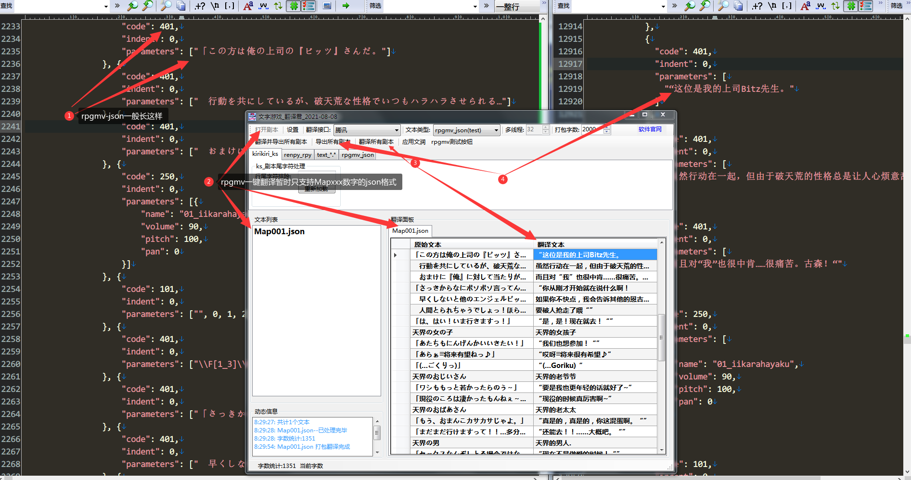

# 文字游戏 翻译君 (云翻 云翻译软件)
支持多种文件类型的一键翻译工具|您与汉化翻译组的距离或许只差一个软件
--|--

吉里吉里ks一键翻译|Renpy一键翻译|Rpgmv一键翻译
--|--|--

      


[github地址](https://sh2288.github.io/transer)
[码云gitee地址](https://gitee.com/sh2288/transer)

QQ1群(已满) [38552538](https://jq.qq.com/?_wv=1027&k=ajBHt2i4) QQ2群 [706514743](https://jq.qq.com/?_wv=1027&k=uNgezthB)
### 软件下载
[度盘提取码:bb3b](https://pan.baidu.com/s/1qObSVEx6ZijYcia8QKic3w) [github](https://github.com/sh2288/krkr_translator/blob/master/%E6%96%87%E5%AD%97%E6%B8%B8%E6%88%8F_%E7%BF%BB%E8%AF%91%E5%90%9B_2019-12-22_%E8%A7%A3%E5%8E%8B%E5%AF%86%E7%A0%8138552538.zip) 
[码云gitee](https://sh2288.github.io/transer)
### 软件用途

任意文本翻译 | 游戏脚本剧本翻译 | 字幕翻译 | 汉化辅助工具
---|---|---|---

### 软件介绍

1. 文本文件任意支持的语言(详见翻译API支持语言列表)翻译成简体中文
2. 翻译好的文件编码为utf16le有签名(仅ks或text类型)
3. 自动识别文件编码shift-jis和utf8,utf16,gb2312等(utf16be无签名除外)
4. 支持文件类型

---|*.ks | *.scn | *.rpy |*.json| \*.*(纯文本)
---|---|---|---|---|---
游戏引擎|吉里吉里xp3|吉里吉里xp3|rpy语言包|RPGMV|纯文本
提取剧本|自动|纯文本+正则|自动(只支持翻译包)|自动(仅Mapxxx.json)|自动提取所有或正则提取

5. 支持的翻译接口,点击直接申请接口API,[翻译接口申请教程](#apitech)

翻译接口| [有道智云](https://ai.youdao.com/login.s) | [百度翻译(含高级版)](https://fanyi-api.baidu.com/api/trans/product/index) | [腾讯翻译君](http://cloud.tencent.com/) | [彩云小译](https://dashboard.caiyunapp.com/user/sign_up/)
---|---|---|---|---
免费额度|50元|无限或200万字/月|500万字/月|100万字/月
多线请求|支持|不支持|不支持|支持
QPS|不限|1或10|5|不限
翻译速度|快|快|一般|很快
打包字数最大值|4000|3000|2000|5000

6. 翻译字数统计
7. 人名修改系统,通过正则提取游戏内人物"说话"时的名字,请根据翻译参考或游戏人物参考对照修改
8. 采用多线程同时翻译多个文件,目前最大支持32个文件同时翻译,效率是以前的单文件的32倍
9. 打包翻译,放弃以往一句一翻的方式,采取批量打包翻译方式
10. 文润系统(后期处理文本用,可以将API返回的常见错误加以修正,例如翻译好的文本中有大量的AAAA,AAAA是翻译结果,但并不一定是正确的结果,通过文润系统可以将所有文本中的AAAA,全部换成您设定好的BBBB)

文润 | 原始 | 修正
---|---|---
----|AAAA|BBBB
例1|阿傻姬|阿萨姬
例2|雪疯|雪风

11. 加入自动激活功能,只支持支付宝付款后的自动激活

### 使用指南
<a id='apitech'></a>
>#### 翻译接口申请教程
申请网址| [有道智云](https://ai.youdao.com/login.s) | [百度翻译(含高级版)](https://fanyi-api.baidu.com/api/trans/product/index) | [腾讯翻译君](http://cloud.tencent.com/) | [彩云小译](https://dashboard.caiyunapp.com/user/sign_up/)
---|---|---|---|---

>##### 有道

>##### 百度

>##### 腾讯

>##### 彩云


>#### 软件使用教程

强烈建议您在正式翻译文件之前,先进行翻译测试(翻译接口-->翻译测试)|
---|

您甚至可以利用此项功能,直接将翻译测试的结果导入到游戏中|
--|


1. **打开剧本**-->批量选择需要翻译的剧本文件(一定要确认不是utf16be无签名的),选择要使用的**翻译接口**,点击**翻译并导出所有剧本**即可
2. 若希望翻译完成后进行修改润色校验等工作,可以先**翻译所有剧本**,然后批量文润或单项修改,全部完成后再**导出所有剧本**
3. **打包字数**设置为**0**时,翻译面板中的文本将执行按每行翻译,而不再将文本按照设定的字数打包
4. **应用文润**在设置窗口第二页,可以设置自己的文润对应表,按字数大->小排列

文润 | 原始 | 修正
---|---|---
----|AAAA|BBBB
例1|阿傻姬|阿萨姬
例2|雪疯|雪风

5. 文本类型**text_regex**表示纯文本+正则表达式,理论上可以翻译任意文本

文本类型 |*.ks | *.scn | *.rpy |*.json| \*.*(纯文本)
---|---|---|---|---|---
游戏引擎|吉里吉里xp3|吉里吉里xp3|rpy语言包|RPGMV|纯文本
提取剧本|自动|纯文本+正则|自动(只支持SDK导出的翻译包,空字串格式)|自动|自动提取所有或正则提取
>##### ks文件类型

>##### rpy文件类型

>##### json(rpgmv)文件类型


>#### 位置说明:

1. 所有翻译好的文本位于翻译文件的目录下的\\(所用翻译接口)_(翻译文件类型)\目录下,譬如 \彩云_kirikiri_ks\

[B站视频教程](https://www.bilibili.com/video/av69298736)
[youtube视频教程](https://youtu.be/8aXjUVPenW8)


>#### 文字游戏_翻译君 内置工具列表
```
\data\ krkrrel(打包)
\tools\ GARbro(解包打包)
\tools\ KrkrExtract4.0.1.4(解包打包)
\tools\ Emeditor(支持多编码转换的文本编辑器)
```
>#### 已知BUG:

1. 错行问题,由于打包翻译时,提交出去的数据和收到的数据(翻译引擎返回值)可能不一致导致,遇到这样的问题,请在表格中出现错行的位置,点击右键-->错行调整
