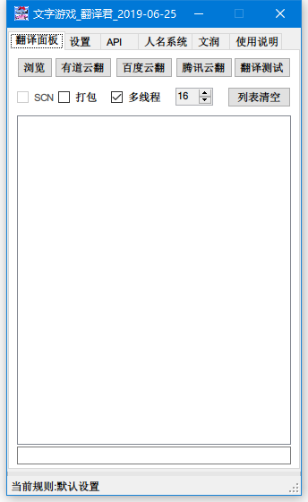
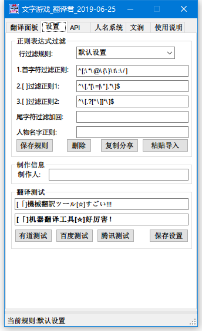
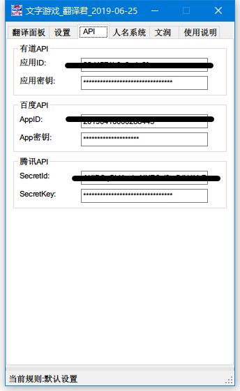

# 文字游戏 翻译君 (云翻 云翻译软件)
     
## 本软件采用后续更新免费制度(激活方式--硬件绑定)
>#### [码云项目地址](https://gitee.com/sh2288/krkr_translator)

### 文字游戏 翻译君 QQ1群 [38552538](https://jq.qq.com/?_wv=1027&k=ajBHt2i4) QQ2群 [706514743](https://jq.qq.com/?_wv=1027&k=uNgezthB) [度盘提取码:bb3b](https://pan.baidu.com/s/1qObSVEx6ZijYcia8QKic3w) 或[git根目录](https://github.com/sh2288/krkr_translator/blob/master/%E6%96%87%E5%AD%97%E6%B8%B8%E6%88%8F_%E7%BF%BB%E8%AF%91%E5%90%9B_2019-12-22_%E8%A7%A3%E5%8E%8B%E5%AF%86%E7%A0%8138552538.zip) 

>#### [B站视频教程](https://www.bilibili.com/video/av69298736)
>#### [youtube视频教程](https://youtu.be/8aXjUVPenW8)

>#### 最新消息
```
2021-07-19
版权问题,软件将不再集成scn解包工具,请自行解包后使用本软件的文本+正则方式翻译
2021-07-16
软件绑定硬件方式变更
新版本ks已完成,直接翻译
待翻译的文本进行打包处理(按照翻译接口提供的最大字符数)提交--
譬如彩云最大字符单次可以提交5000字,程序将会按照句子打包到即将超过5000字时,进行提交
添加renpy?
添加rpgmv?
2021-06-29
吉里吉里剧本文件,直接精确识别剧本文本,不再需要懂正则表达式,由程序自动识别
2021-05-21
提供一个,根据对话尾部特殊字符串的万用正则
^((?!^.*[r]\]\\$).)
只需替换这个[r]\]\\即可
^((?!^.*[r]\]\\$).)
表示对以r]\结尾的行,反匹配
或者说不跳过符合r]\结尾的行(也就是需要翻译的行)
貌似有点烧脑

翻译君518版本,添加的功能剧本提取功能和行间文本抓取功能暂时未开放,很抱歉,这些功能还在测试中...
2021-05-20
WIP添加正向过滤规则ing,居然又给忘了,个人测试这种直接匹配方式要比目前的排除法过滤更加精准
2021-05-18 
修复一处文润bug
2020-08-21 更新说明
1. 修复激活支付宝接口错误
2. 开放有道API翻译接口(无需激活)
2020-10-10
1.更改提取文本的方式,由正则直接匹配*
2.可视化翻译进度?
2020-09-04
1.考虑行间提取过滤方式,这个会更加精确的提取剧本*
2020-08-21 更新说明
1. 修复激活支付宝接口错误
2. 开放有道API翻译接口(无需激活)
2020-08-21
1.修复激活支付宝接口错误
2.开放有道API翻译接口(无需激活)
2020-04-24
Ren'PY引擎,直接翻译支持?
2020-04-23
SCN解包打包工具集成,显示实时翻译结果?(不明原因卡死时,可以看出来)
2019-12-22更新说明
1. 添加彩云小译API接口
2. 彩云小译BUG处理,异常处理修正,出现异常后自动重试,保证翻译进度不被异常卡死
2019-12-18
彩云小译API接口bug较多,已修正或者说是绕过,缺乏接口文档,自写异常处理...解决多线程莫名其妙的问题
2019-12-17
加入彩云小译API接口,可多线程,翻译质量同百度,语句通顺略胜于百度,仍在测试中...
2019-10-22
新版更新,修正两处错误(百度json问题,SCN文件名问题),一处更改(检查更新链接指向github)
2019-10-21
百度json问题,解决中...
2019-10-18
刚刚发现的,百度云翻抽风中...
2019-10-10
最近发现正向匹配可能要比过滤匹配要简单的多,而程序一开始是按照过滤匹配设计的,计划加入正向匹配(反向过滤)
2019-09-26
超详细傻瓜式WIKI图文+视频教程筹备中...
2019-08-28
当百度API的返回错误时,进行5次重试,极大减少百度API的出错几率,自定错误码正则为 --bd.*?bd--
2019-08-27
加入QPS选项设置后,百度的超限问题是没了,但又多了超时问题,解决中...
2019-08-26
加入百度和腾讯API的QPS选项设置
百度高级版设置10,普通版设置1,腾讯设置5
2019-08-16
游戏汉化翻译流程图解
2019-08-08
测试翻译的代码,忘记更改请求限制了,虽然不影响正式翻译,周末更正
2019-08-04
调整腾讯和百度的API请求频率(每秒不超过5),并限制百度和腾讯API不能使用多线程,保证翻译的稳定性
2019-07-19
百度翻译api更新,限制了api每秒调用次数,多线程不可用(以前用多线程可是很快的)
```





>#### 软件特性:

1. 文本文件任意支持的语言(见API支持语言列表)翻译成中文(并不局限于ks或scn文件)
2. 翻译好的文件编码为utf16le有签名
3. 自动识别编码shift-jis和utf8,utf16,gb2312等(utf16be无签名除外)
4. 由正则过滤不需要翻译的行,以及其他不需要翻译的内容,精准提取文本
5. 调用有道和百度api翻译,腾讯API接口(腾讯API有每秒5次请求限制,暂时无法使用多线程),由于api额度有限,需用户自行申请
6. SCN文本格式一键直翻,解文本封文本全自动处理
7. 翻译完成自动打包xp3(可选项)
8. 翻译字数统计(实际略多于api实际翻译字数,误差大概10%以内)只精确到翻译行的字数,行内不需要翻译的字忽略不计
9. 人名修改系统,通过正则提取游戏内人物"说话"时的名字,请根据翻译参考或游戏人物参考对照修改
10. 采用多线程同时翻译多个文件,目前最大支持32个文件同时翻译,效率是以前的单文件的32倍
11. 添加制作人信息,会在每次翻译最开始的文本前插入此信息(xxxx制作)这样的文字,仅插入一次
12. 文润系统(后期处理文本用,可以将API返回的常见错误加以修正,例如翻译好的文本中有大量的AAAA,AAAA是api返回的翻译结果,但并不是正确的结果,通过文润系统可以将所有文本中的AAAA,全部换成您设定好的BBBB,文润系统尽量让原始字符多的排在最前面)
13. 加入自动激活功能,目前只支持支付宝付款后的自动激活
14. 针对百度和腾讯的翻译API,添加QPS选项,百度高级版设置10,普通版设置1,腾讯设置5
15. 添加彩云小译API接口,彩云小译BUG处理,异常处理,出现异常后自动重试,保证翻译进度不被异常卡死

>#### 文字游戏_翻译君 内置工具列表 软件目录\data\下的工具不请要改动
```
\data\ PsbTextDumperV2和PsbTextInserter(PSB文本命令行处理工具)(SCN这个后面详细说)
\data\ krkrrel(打包)
\tools\ GARbro(解包打包)
\tools\ KrkrExtract4.0.1.4(解包打包)
\tools\ Emeditor(支持多编码转换的文本编辑器)
```
>#### 已知BUG:(请尽量避免以下操作)

1. 待翻译列表内的文件路径如果不同时,会出错.
2. SCN文件和ks文件同时出现在待翻译列表内,会出错.
3. 规则全为空时,翻译scn会出错,但不影响最终结果.

>#### 使用说明:

1. 文字游戏_机翻君-->浏览-->选择需要翻译的剧本文件*.ks或*.txt(一定要确认不是utf16be无签名的)*.scn不用管,一键直翻即可
2. 翻译完成后替换掉原始的剧本文件*.ks
3. 打包进游戏测试
4. 人名系统正则表达式例子 (?<=^\[NAME_[MW] n=\").+(?=\"\]\\$) 匹配下句中的 [NAME_W n="xxxx"]\ xxxx部分

>#### 云翻译API简介
---| 有道智云 | 百度翻译(含高级版) | 腾讯翻译君 | 彩云小译
---|---|---|---|---
免费额度|100元|无限或200万字/月|500万字/月|100万字/月
多线请求|支持|不支持|不支持|支持
QPS|不限|1或10|5|不限
翻译速度|快|快|一般|很快

>#### 云翻译API申请方法
-- | 云翻译API申请方法
---|---
有道| [有道智云](https://ai.youdao.com/)-->自然语言翻译-->翻译实例-->创建实例-->名称XX选文本翻译-->应用管理-->我的应用-->创建-->API方式-->绑定刚刚的翻译实例-->记下应用ID和应用密钥并确认已经绑定翻译实例--有道智云给新用户100元,翻译按字数收费
百度| [百度翻译开放平台](http://api.fanyi.baidu.com/api/trans/product/index)-->开通通用翻译API-->每个月200万字符免费,超出按字数收费
腾讯|[腾讯云机器翻译API](https://console.cloud.tencent.com/tmt)-->(需实名认证)云产品-->机器翻译-->免费试用-->按提示操作即可
彩云小译|[彩云科技开放平台](https://dashboard.caiyunapp.com/user/sign_in/)-->e-mail注册激活-->按照表格填写-->等待审核通过-->拿到翻译令牌

>#### 位置说明:

1. KS,所有翻译好的文本和xp3封包位于翻译文件的目录下的\trans_cn_****\目录下
2. SCN,所有翻译好的文本位于翻译文件的目录下的\trans_cn_****\目录下,所有翻译后生成的scn和xp3封包位于\trans_cn_****\OutScript\目录下

>### 更新历史:

>#### 2019-10-22
1. 修正百度翻译时返回JSON基元的错误,重写部分代码
2. 检查更新网址变更为github地址,因为新浪实在懒得更新
3. 修正SCN分解合并处理时,文件名不能有空格或中文的错误(早期已经修正,但是由于更新了QPS设置时,未使用原来的代码,导致此问题)

>#### 2019-08-28
1. 针对百度和腾讯的翻译API,添加QPS选项,百度高级版设置10,普通版设置1,腾讯设置5 
2. 当百度API的返回错误时,进行5次重试,极大减少百度API的出错几率,自定错误码正则为 --bd.*?bd--


>#### 2019-08-04
1. 调整腾讯和百度的API请求频率(每秒不超过5),并限制百度和腾讯API不能使用多线程,保证翻译的稳定性

>#### 2019-06-25
1. 修复腾讯api设置不能保存的bug
2. 更改原来的翻译方向jp-->zhs,改为auto-->zhs,也就是说可以将任意支持的语言(见API支持语言列表)翻译成中文
3. tools下添加xmoeproject/KrkrExtract4.0.1.4解包打包工具----官网 https://github.com/xmoeproject/KrkrExtract

>#### 2019-05-29
1. 增加腾讯API接口(腾讯API有每秒5次请求限制,暂时无法使用多线程)
2. 增加文润系统(后期处理文本用,可以将API返回的常见错误加以修正)

>#### 2019-05-08
1. SCN文件防呆处理,SCN不能和普通文本文件同时处理,因为SCN不是文本
2. 修复路径不能为中文或空格等特殊字符的bug,但是路径中的日文特殊字符(譬如日文的大点和音符)可能仍无法处理,请注意改名
3. 采用多线程同时翻译多个文件
4. 翻译字数统计
5. 人名修改系统

>#### 2019-04-29
1. 添加scn直翻支持(不再手动提出文本和手动封回文本),以前手工部分全部交给翻译君处理
2. 添加自动打patch.xp3功能,勾选后,翻译结束自动打包xp3,使用时注意改名字
3. 优化代码,修复大量bug
4. 添加列表清空功能
5. 添加规则保存,删除,复制分享,粘贴导入功能(可给别人分享您的正则规则或粘贴使用别人分享的规则)

>#### 2019-04-25
1. 添加机翻测试按钮,避免不必要的浪费,对于比较特殊的剧本文件,建议先进行机翻测试.
2. 去掉部分正则匹配方式,因为翻译文本中带有需要转义的字符时,翻译会出错
3. 添加正则缺省按钮,用户在自行该正则时,改乱后可以调回默认值

