### 百度翻译申请

1.  注册并登陆百度翻译开发平台
    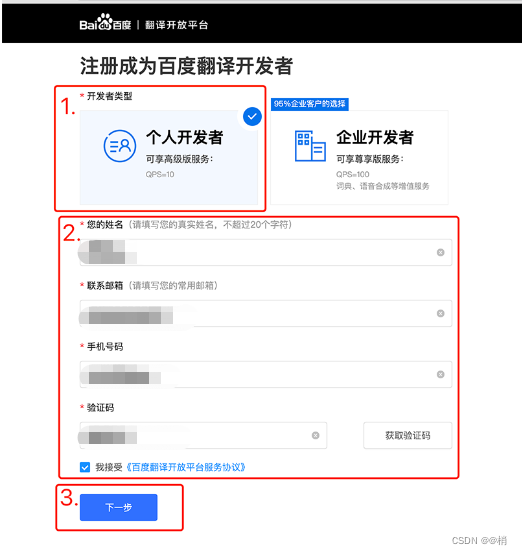
    
2.  [申请通用翻译API](https://fanyi-api.baidu.com/product/11)(高级版： 每月100万字符免费额度)
    
3.  开通标准版
    
4.  应用名称可填 文本翻译，提交后立即开通
    
5.  进入**管理控制台**
    
6.  查看接口 APPID 与秘钥
    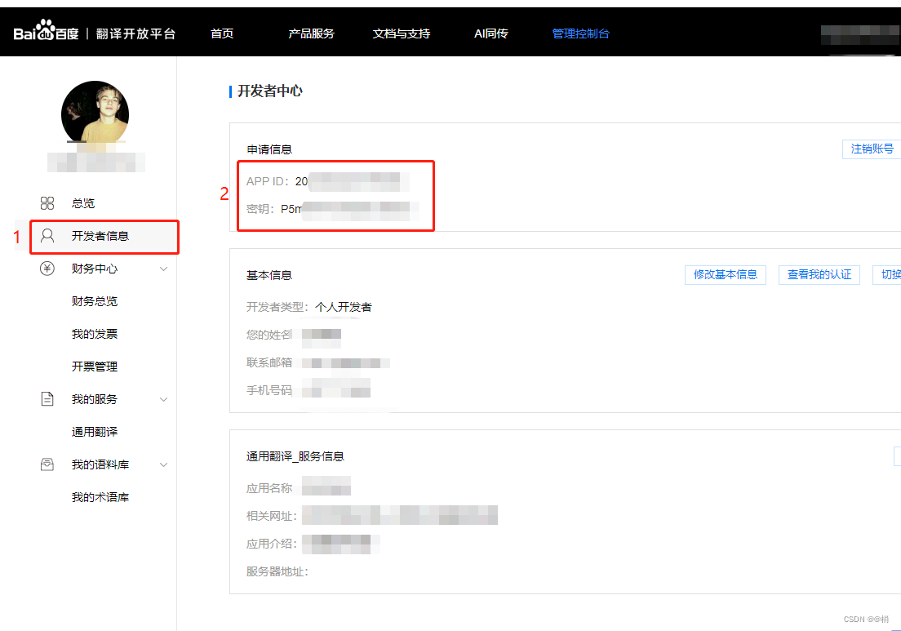
    

### 腾讯翻译申请

1.  注册并登陆腾讯云
    
2.  [申请机器翻译TMT](https://cloud.tencent.com/product/tmt)(每月500万字符免费额度)
    
3.  点击开通付费版
    
4.  提示这个可以不用管 点继续使用
    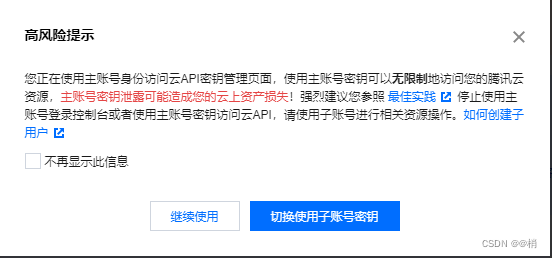
    
5.  开通后 鼠标悬停在右上角头像上，点击访问管理
    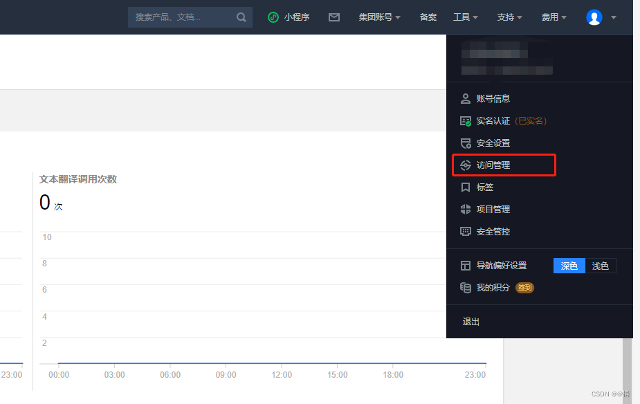
    
6.  点击左侧访问密钥下的**API密钥管理**
    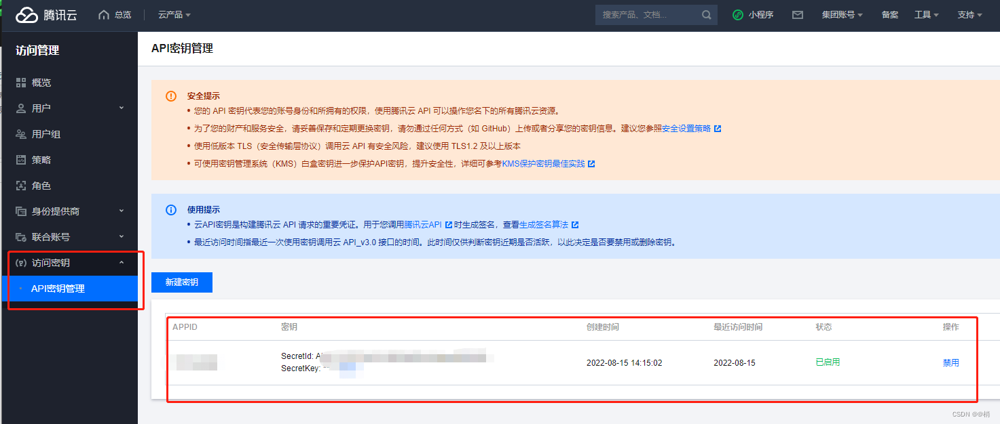
    

### 阿里翻译申请

1.  注册并登陆阿里云
    
2.  [申请通用版翻译引擎](https://www.aliyun.com/product/ai/base_alimt)(每月100 万字符免费额度)
    
3.  开通后 进去控制台，鼠标悬停在右上角用户头像
    
4.  点击**AccessKey 管理**
    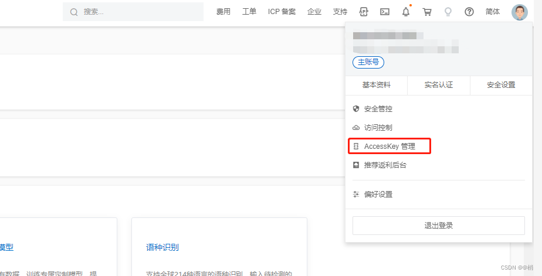
    
5.  安全提示 点击继续使用
    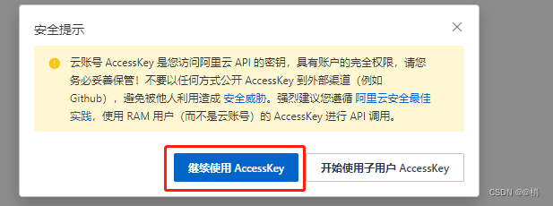
    
6.  然后点击创建 **AccessKey**
    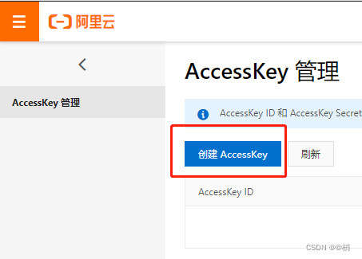
    
7.  通过短信验证后提示 **AccessKey** 创建成功，即可查看**AccessKey ID**与**AccessKey Secret**
    

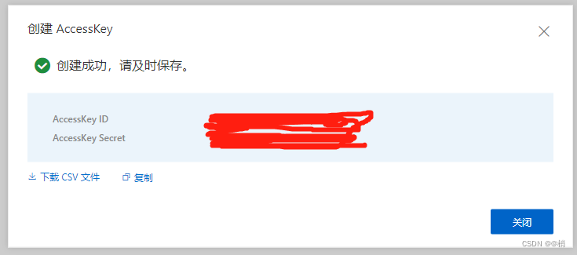

### 有道翻译申请

1.  注册并登陆有道智云，注册时 开发者名称填写文本翻译，渠道填写翻译插件即可
2.  [开通文本翻译服务](https://ai.youdao.com/console/#/service-singleton/text-translation)(50元体验金，用完及收费)
3.  点击创建应用
    应用名称写**文本翻译**
    应用类别选择**实用工具**
    选择服务选择**文本翻译**
    接入方式选择**API**
4.  开通后进入控制台 选择自然语言翻译服务下的文本翻译即可查看**APP ID**和**秘钥**
    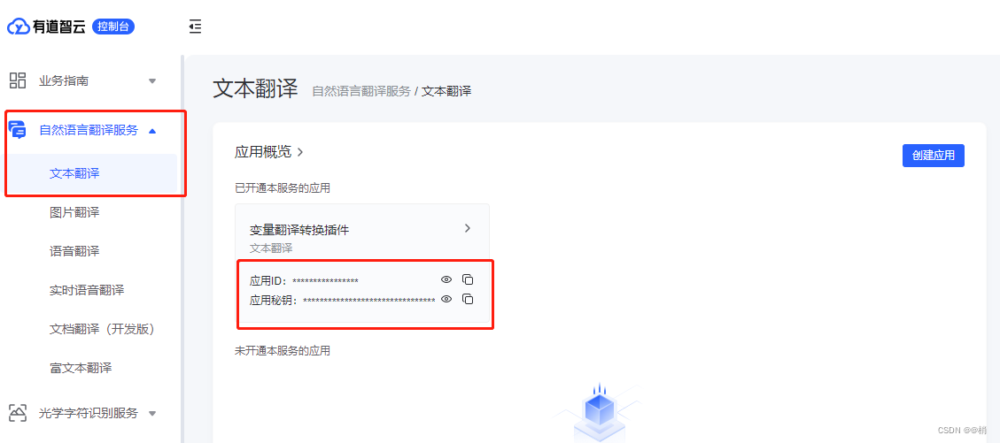
### 彩云小译申请
1. [彩云小译](https://dashboard.caiyunapp.com/user/sign_up/)
2. 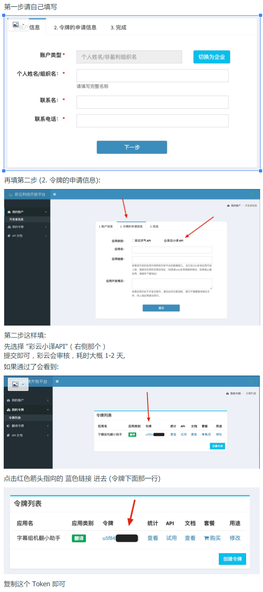
### 小牛翻译申请
1. [小牛翻译](https://niutrans.com/)
2. 注册(普通)-登录-控制台-个人中心-API-KEY
### 火山翻译申请
申请步骤
1. [API 接入流程概览 机器翻译-火山引擎](https://www.volcengine.com/docs/4640/130872)，跟随官方指导，完成注册账号、实名认证、开通服务这三个步骤。需要在控制台进行操作，火山引擎控制台
2. 在第四步获取密钥中，火山引擎提供了两个选项：    
        2.1 继续创建（使用主账号创建密钥，更便捷，这个 key 可以调用主账号资源，不太安全），选择“继续创建“后，表格里会出现一条新的数据，其中就包含我们要用到的“Access Key ID“和“Secret Access Key“。    
        2.2 去新建子用户（建议使用子用户创建密钥，更安全），获取“Access Key ID“和“Secret Access Key“, 该子账户必须拥有TranslateFullAccess 权限

